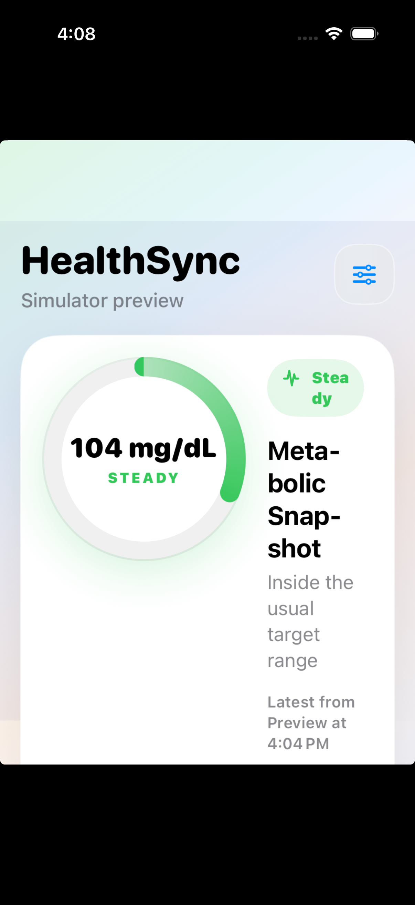

# HealthSync iOS

HealthSync is a SwiftUI iOS app that turns Apple HealthKit data into a polished, sync-ready health dashboard. It reads personal health metrics such as glucose, heart rate, steps, active energy, and body mass, estimates a recent glucose trend, then sends recent samples to a configurable backend API.

Built by **Ritika Parashar** as a recruiter-facing iOS project focused on clean architecture, HealthKit integration, MVVM, background refresh, and thoughtful product design.



## Why I Built This

Apple Health contains valuable personal health data, but that data is usually locked inside the device. I built HealthSync to explore how an iOS app can safely collect HealthKit readings, present them in a useful interface, and sync them to a private backend for future analytics, dashboards, or AI-assisted insights.

This project is especially useful for glucose and wellness tracking workflows, while remaining generic enough to support other HealthKit metrics.

## Highlights

- **HealthKit integration** for glucose, heart rate, steps, active energy, and body mass.
- **MVVM architecture** with a dedicated `DashboardViewModel` coordinating UI state, settings, sync eligibility, and lifecycle events.
- **Custom SwiftUI dashboard** with a glucose command dial, range indicator, glucose forecast card, readiness tiles, metric cards, and sync pipeline state.
- **Explainable glucose trend prediction** that uses recent glucose readings to label the near-term direction as likely rising, falling, stable, or unavailable.
- **Simulator preview mode** with realistic demo data because HealthKit data is only available on real devices.
- **Safe sync behavior** that prevents fake simulator data from being uploaded.
- **Configurable backend sync** using API URL, API secret, and user ID.
- **Background refresh support** using `BGTaskScheduler` for best-effort periodic sync on device.
- **Privacy-first design**: data goes directly from the user's iPhone to their configured backend.

## Tech Stack

| Area | Technology |
|---|---|
| Language | Swift |
| UI | SwiftUI |
| Architecture | MVVM |
| Health Data | Apple HealthKit |
| Background Work | BackgroundTasks |
| Networking | URLSession + Codable |
| Persistence | UserDefaults for non-sensitive configuration |
| Platform | iOS 17+ |

## Architecture

```text
HealthSyncApp
    |
    v
ContentView  <---- renders state and forwards user actions
    |
    v
DashboardViewModel
    |              |
    v              v
HealthKitManager  SyncManager
    |              |
    v              v
Apple Health      Backend API
```

### Main Responsibilities

- `ContentView.swift`: SwiftUI screen composition and reusable UI components.
- `DashboardViewModel.swift`: Presentation state, settings persistence, sync eligibility, glucose status mapping, prediction presentation, and lifecycle handling.
- `HealthKitManager.swift`: HealthKit authorization, latest metric fetching, glucose trend estimation, sample conversion, and simulator demo data.
- `SyncManager.swift`: Sync request construction, URLSession networking, background refresh registration, and sync status.
- `HealthSync.swift`: App entry point and scene phase forwarding.

## Supported Health Metrics

- Blood Glucose, shown in `mg/dL`
- Heart Rate, shown in `bpm`
- Step Count
- Active Energy Burned, shown in `kcal`
- Body Mass, shown in `kg`

## Glucose Prediction

HealthSync does not invent health data. It reads available blood glucose samples from Apple HealthKit, looks at the most recent readings, and calculates an explainable trend based on how quickly the values changed over time.

The prediction is intentionally transparent:

- **Likely rising** when recent readings are increasing quickly.
- **Likely falling** when recent readings are decreasing quickly.
- **Likely stable** when recent readings change slowly.
- **Unavailable** when there are not enough recent samples.

The app also shows the sample count, confidence, and rationale behind the forecast. This keeps the feature interview-friendly because it demonstrates product thinking, data handling, and safety without pretending to replace clinical judgement.

## How Sync Works

1. The user enters an API URL, API secret, and user ID in Settings.
2. The app requests HealthKit read permission.
3. `HealthKitManager` fetches recent HealthKit samples.
4. Samples are converted into a Codable `HealthSample` model.
5. `SyncManager` sends a JSON payload to:

```text
POST /api/samples
Header: X-API-Secret: <user-provided-secret>
```

No real API credentials are committed to this repository.

## Running The Project

1. Clone the repository.
2. Open `HealthSync.xcodeproj` in Xcode.
3. Select the `HealthSync` scheme.
4. Run on the iOS Simulator to preview the UI with demo data.
5. Run on a physical iPhone to test real HealthKit permission and syncing.

### Requirements

- Xcode 16 or newer
- iOS 17 or newer
- Physical iPhone for real HealthKit data
- A backend API compatible with the `/api/samples` endpoint

## Important Simulator Note

The iOS Simulator does not provide real Apple Health data. HealthSync includes a simulator preview mode so recruiters and reviewers can still evaluate the UI, architecture, and flow without a physical device. Sync is intentionally disabled in preview mode to avoid uploading fake data.

## What I Focused On

- Building a real-world iOS feature, not just a static UI.
- Keeping SwiftUI views declarative and moving logic into the ViewModel.
- Handling device-vs-simulator behavior cleanly.
- Presenting health state in a way that is fast to scan.
- Adding a transparent prediction layer without making unsafe medical claims.
- Writing code that can be extended with testing, more metrics, charts, and secure storage.

## Future Improvements

- Add unit tests for `DashboardViewModel`.
- Store API secrets in Keychain instead of UserDefaults.
- Add trend charts for glucose and heart rate.
- Replace the rule-based forecast with an on-device Core ML model after collecting enough labeled historical data.
- Add offline retry queue for failed syncs.
- Add protocol abstractions for easier service mocking.
- Add Apple Watch support for companion health summaries.


## Disclaimer

This app is a personal engineering project and is not intended for medical diagnosis, treatment, or emergency use.
